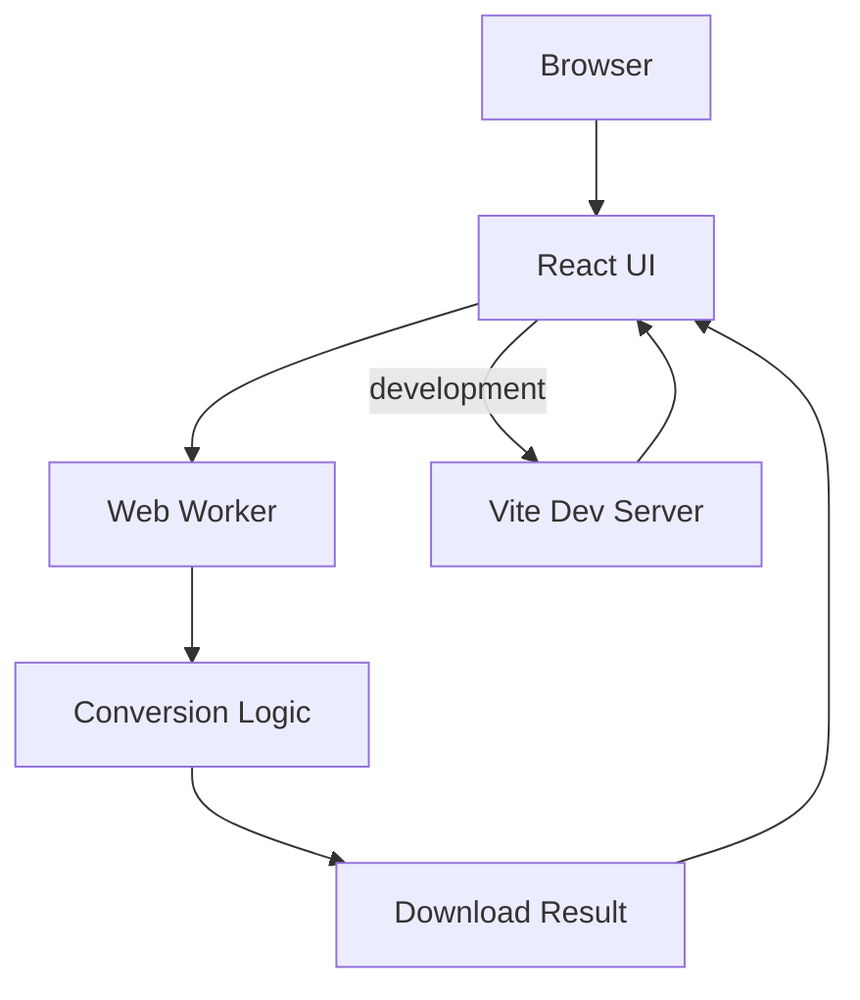

# Project Architecture

```mermaid
flowchart TD
    A[Browser] --> B[React UI]
    B --> C[Web Worker]
    C --> D[Conversion Logic]
    D --> E[Download Result]
    B -->|development| F[Vite Dev Server]
    F --> B
    E --> B
```

This simplified diagram shows how the browser interacts with the React interface and web worker to perform image conversion directly on the client side.
